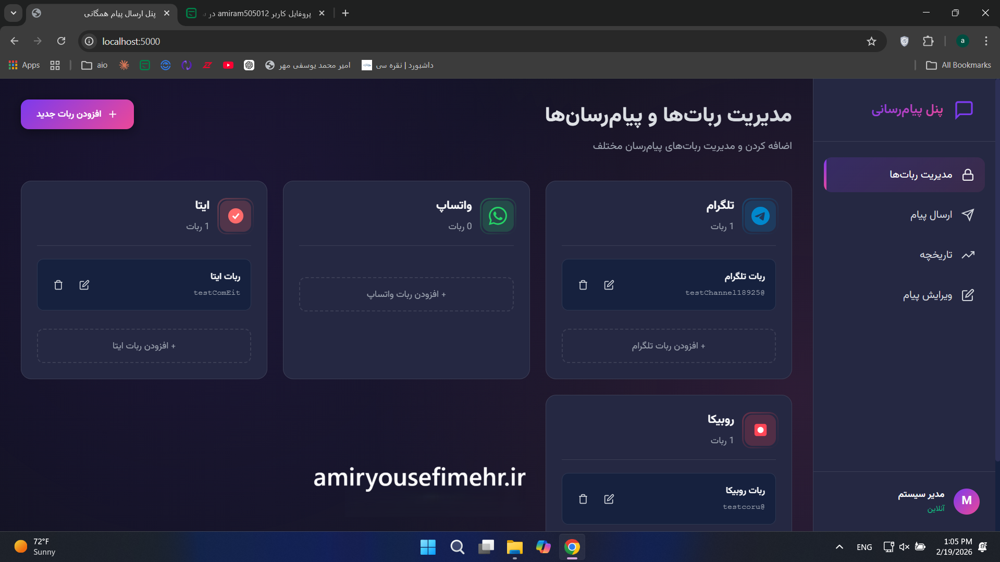
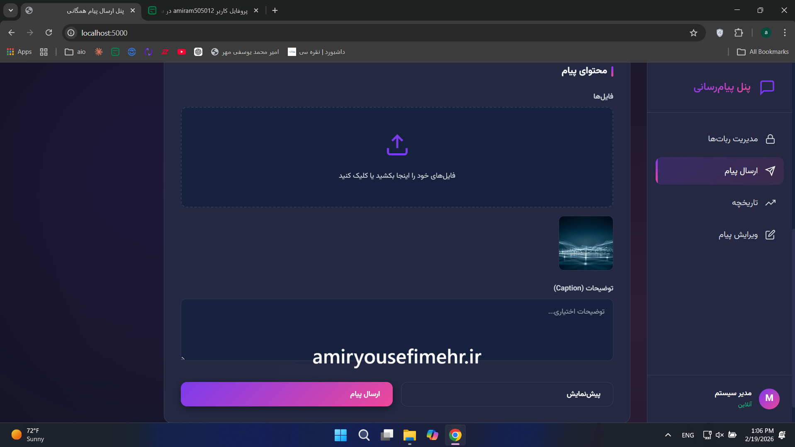
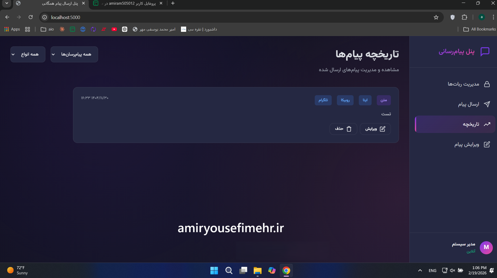
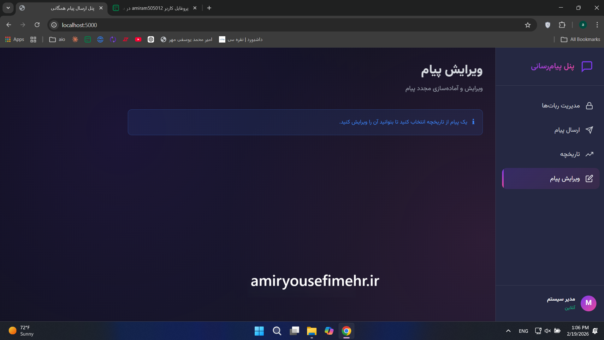

# 📡 پنل مدیریت کانال‌ها و ربات‌های پیام‌رسان

## معرفی پروژه

این پروژه یک **وب‌اپلیکیشن تحت وب برای مدیریت متمرکز کانال‌ها و ربات‌های پیام‌رسان** است که با استفاده از Flask طراحی و توسعه داده شد.

هدف اصلی سیستم، ایجاد یک پنل واحد برای مدیریت چندین کانال و ربات و ساده‌سازی فرآیند ارسال پیام، بدون نیاز به ورود و مدیریت جداگانه هر مقصد است.

---

##  پیش‌نمایش پروژه

###  تصاویر پروژه

---

###  ویدئوی عملکرد

[▶ مشاهده ویدئوی عملکرد پروژه](./assets/demo.mp4)

---

##  مدیریت کانال‌ها و ربات‌ها

کاربر می‌تواند چندین ربات یا کانال را به سیستم اضافه کرده و اطلاعات آن‌ها را از طریق داشبورد مدیریت کند.

این ساختار امکان مدیریت متمرکز مقصدهای مختلف را در اختیار کاربر قرار می‌دهد.

---

##  ارسال محتوای چندرسانه‌ای

سیستم امکان ارسال انواع مختلف محتوا را فراهم می‌کند:

* پیام متنی
* تصویر
* فایل صوتی
* فایل
* کپشن و توضیحات

همچنین امکان ارسال یک پیام به **چند کانال به‌صورت همزمان** وجود دارد.

---

##  مدیریت پیام‌ها

برای پیام‌های ارسال‌شده، تاریخچه‌ای در سیستم نگهداری می‌شود تا کاربر بتواند سوابق فعالیت‌ها را مشاهده و مدیریت کند.

امکانات مدیریت پیام شامل:

* مشاهده تاریخچه پیام‌ها
* ویرایش پیام‌ها
* حذف پیام‌ها
* مدیریت کپشن و توضیحات
* بررسی محتوای ارسال‌شده

---

##  داشبورد مدیریتی

یک رابط کاربری مدرن و **RTL** برای استفاده راحت کاربران فارسی‌زبان طراحی شده است.

ساختار داشبورد به‌گونه‌ای طراحی شده که مدیریت کانال‌ها، ربات‌ها و پیام‌ها از یک محیط واحد امکان‌پذیر باشد.

---

##  معماری نرم‌افزار

ساختار Backend با استفاده از **Flask Routing و Blueprints** به‌صورت ماژولار پیاده‌سازی شده تا توسعه و اضافه‌کردن قابلیت‌های جدید در آینده ساده‌تر باشد.

همچنین از **Jinja2 Template Engine** برای تولید صفحات وب و JavaScript برای ایجاد تعاملات سمت کاربر استفاده شده است.

---

##  مدیریت فایل

سیستم دارای قابلیت دریافت و مدیریت فایل‌های چندرسانه‌ای است و فرآیندهایی مانند:

* Upload
* Preview
* مدیریت فایل‌های ارسالی

برای محتوای چندرسانه‌ای در نظر گرفته شده است.

---

##  مشخصات پروژه

| مشخصات                | توضیحات                              |
| --------------------- | ------------------------------------ |
| **نقش**               | توسعه‌دهنده فول‌استک                 |
| **نوع سرویس**         | اسکریپت‌نویسی، اتوماسیون و تست‌نویسی |
| **مدت انجام**         | ۵ روز                                |
| **محدوده قیمت پروژه** | ۱۰,۰۰۰,۰۰۰ تا ۳۰,۰۰۰,۰۰۰ تومان       |

---

##  فناوری‌های استفاده‌شده

* **Python**
* **Flask**
* **Jinja2**
* **HTML5**
* **CSS3**
* **JavaScript**
* **Telegram APIs**
* **RESTful Logic**
* **CRUD**
* **File Upload & Preview**
* **Responsive RTL UI**

---

##  نتیجه پروژه

این پروژه یک پنل متمرکز برای **مدیریت کانال‌ها، ربات‌ها و ارسال محتوای چندرسانه‌ای** ایجاد کرد.

استفاده از معماری ماژولار در Backend نیز امکان توسعه سیستم و اضافه‌کردن قابلیت‌های جدید را در آینده فراهم می‌کند.

---

##  سفارش پروژه مشابه

اگر به توسعه **پنل‌های مدیریتی، ربات‌های پیام‌رسان، سیستم‌های اتوماسیون یا داشبوردهای اختصاصی** نیاز دارید:

 **[ثبت سفارش پروژه](https://amiryousefimehr.ir/request-project)**

---

##  مشاهده نمونه‌کارهای بیشتر

 **[مشاهده رزومه و نمونه‌کارهای من](amiryousefimehr.ir)**

---
